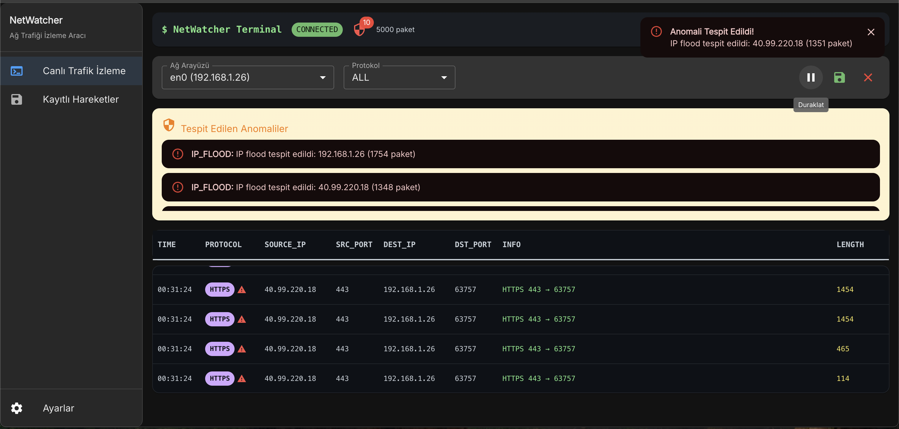
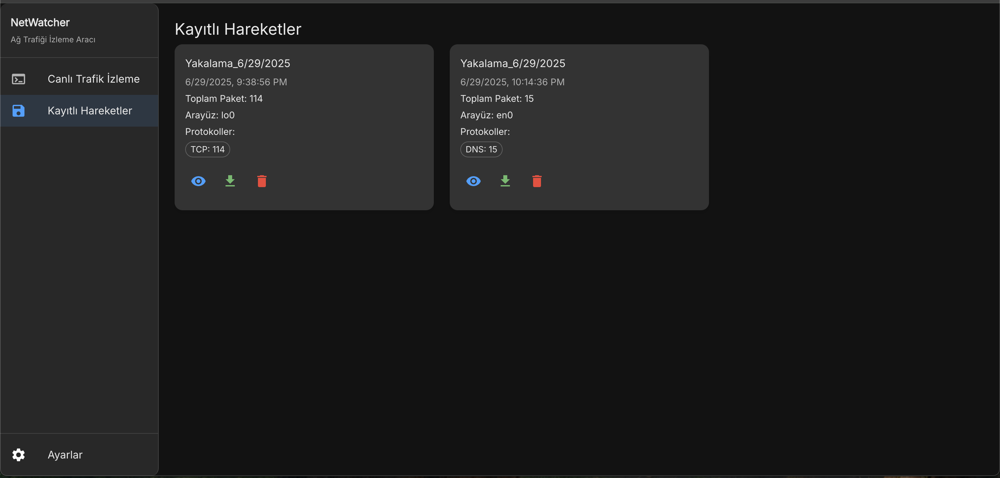

# NetWatcher - Advanced Network Traffic Monitoring and Analysis Tool

<div align="center">


</div>

NetWatcher is a modern network monitoring tool designed to monitor, analyze, and detect potential anomalies in local network traffic in real-time. This project aims to provide both visual and functional, simple yet powerful solutions that can appeal to users with different levels of technical knowledge.

## 🖥️ User Interface

### Live Traffic Monitoring

*Real-time network traffic monitoring with terminal-style interface, protocol filtering, and anomaly detection alerts*

### Saved Captures Management

*Historical traffic data management with detailed statistics and export capabilities*

## 🌟 Core Features

### 🔄 Real-Time Monitoring
- **Live Traffic Stream**: Real-time capture and display of network packets
- **WebSocket-Based Communication**: Real-time data transmission with low latency
- **Terminal View**: Professional terminal-like interface
- **Auto-Scroll**: Automatic display of new packets

### 🔍 Protocol Analysis and Filtering
- **Multi-Protocol Support**: TCP, UDP, HTTP, HTTPS, ICMP, DNS, ARP
- **Dynamic Filtering**: Real-time protocol-based filtering
- **Detailed Packet Information**: Source/destination IP, port information, packet size
- **Color-Coded Protocols**: Different color codes for each protocol

### 🚨 Advanced Anomaly Detection
- **High Packet Rate Detection**: Abnormal traffic density alerts
- **Unusual Port Usage**: Unexpected port activities
- **IP Flooding Detection**: Heavy traffic detection from the same IP
- **Suspicious Connection Analysis**: Potential security threats
- **Real-Time Alerts**: Instant notification system

### 💾 Data Storage and Management
- **Traffic Capture Saving**: Saving monitored data to local storage
- **Record Viewing**: Analysis of historical traffic data
- **JSON Export/Import**: Data transfer in standard format
- **Automatic Record Management**: Performance optimization with 5000 packet limit

### 🎛️ User Interface
- **Modern Material-UI Design**: User-friendly and responsive interface
- **Dark Theme**: Terminal-like appearance
- **Virtualized Table**: High-performance data display
- **Interface Selection**: Switching between different network cards

## 🏗️ Technical Architecture

### Backend (Python)
```
backend/
├── main.py           # FastAPI application and WebSocket management
├── sniffer.py        # Scapy-based packet capture and anomaly detection
├── requirements.txt  # Python dependencies
└── venv/            # Virtual environment
```

**Technologies Used:**
- **FastAPI**: Modern, fast web framework
- **Scapy**: Network packet manipulation and analysis
- **WebSockets**: Real-time communication
- **Asyncio**: Asynchronous programming
- **Netifaces**: Network interface management

### Frontend (React + TypeScript)
```
frontend/
├── src/
│   ├── components/
│   │   ├── Layout.tsx        # Main page layout
│   │   └── SavedCaptures.tsx # Saved data component
│   ├── pages/
│   │   ├── LiveFeed.tsx      # Live traffic page
│   │   └── SavedCaptures.tsx # Saved captures page
│   ├── App.tsx              # Main application component
│   ├── config.ts            # Configuration file
│   └── theme.ts             # Material-UI theme settings
└── public/
    └── index.html           # HTML template
```

**Technologies Used:**
- **React 18**: Modern user interface
- **TypeScript**: Type safety
- **Material-UI (MUI)**: UI components
- **React Router**: Page routing
- **React Window**: Virtualized lists
- **Recharts**: Data visualization

## 📋 System Requirements

### Minimum Requirements
- **Operating System**: Windows 10/11, macOS 10.15+, Linux (Ubuntu 18.04+)
- **Python**: 3.8 or higher
- **Node.js**: 16.0 or higher
- **RAM**: 4GB (recommended: 8GB)
- **Disk Space**: 500MB

### Permission Requirements
⚠️ **Important**: NetWatcher requires system-level permissions to capture network packets:
- **Linux/macOS**: `sudo` privileges required
- **Windows**: Run as administrator required

## 🚀 Installation

### 1. Clone the Project
```bash
git clone https://github.com/username/NetWatcher.git
cd NetWatcher
```

### 2. Backend Setup
```bash
# Navigate to backend directory
cd backend

# Create Python virtual environment
python3 -m venv venv

# Activate virtual environment
# Linux/macOS:
source venv/bin/activate
# Windows:
venv\Scripts\activate

# Install dependencies
pip install -r requirements.txt
```

### 3. Frontend Setup
```bash
# Navigate to frontend directory
cd ../frontend

# Install Node.js dependencies
npm install
```

## 🏃‍♂️ Running the Application

### 1. Start Backend
```bash
cd backend
source venv/bin/activate  # Linux/macOS
# venv\Scripts\activate   # Windows

# Normal user mode (limited features)
python main.py

# With sudo for full features (recommended)
sudo venv/bin/python main.py
```

Backend runs on `http://localhost:8000` by default.

### 2. Start Frontend
```bash
cd frontend
npm start
```

Frontend automatically opens at `http://localhost:3000`.

## 📖 Usage Guide

### Main Page (Live Feed)
1. **Interface Selection**: Select the network card you want to monitor from the dropdown menu
2. **Protocol Filter**: Apply filters to focus on specific protocols
3. **Start/Stop**: Control traffic monitoring
4. **Save**: Save current traffic to localStorage

### Protocol Color Codes
- 🟢 **HTTP**: Web traffic
- 🔵 **HTTPS**: Encrypted web traffic  
- 🟡 **TCP**: General TCP connections
- 🟠 **UDP**: UDP packets
- 🟣 **DNS**: Domain name resolutions
- 🔴 **ICMP**: Ping and network diagnostic packets
- ⚪ **ARP**: Address Resolution Protocol

### Anomaly Alerts
The system detects the following situations:
- **High Packet Rate**: 100+ packets per second
- **Unusual Port Usage**: Unexpected high port numbers
- **IP Flooding**: 50+ packets from a single IP
- **Suspicious Connection**: SSH, Telnet, RDP connection attempts

### Saved Captures
- View saved traffic data
- Export in JSON format
- Examine detailed protocol statistics
- Delete unwanted records

## 🔧 Configuration

### Backend Settings
In `backend/main.py`:
```python
# Port setting
uvicorn.run(app, host="0.0.0.0", port=8000)

# CORS settings
app.add_middleware(CORSMiddleware, allow_origins=["*"])
```

### Frontend Settings
In `frontend/src/config.ts`:
```typescript
export const API_BASE_URL = 'http://localhost:8000';
export const WS_BASE_URL = 'ws://localhost:8000';
```

### Anomaly Threshold Values
In `backend/sniffer.py`:
```python
class AnomalyDetector:
    def __init__(self):
        self.packet_rate_threshold = 100    # Packets/second
        self.unusual_port_threshold = 10    # Unusual port threshold
        self.ip_flood_threshold = 50        # IP flood threshold
```

## 🔍 API Reference

### REST Endpoints
```http
GET /api/interfaces
```
Lists available network interfaces.

**Response:**
```json
{
  "interfaces": [
    {
      "name": "en0",
      "ip": "192.168.1.100",
      "mac": "aa:bb:cc:dd:ee:ff"
    }
  ]
}
```

### WebSocket Endpoints
```http
WS /ws/live_packets
```
Streams real-time packet data.

**Send:**
```json
{
  "interface": "en0",
  "isPaused": false,
  "protocolFilter": "TCP"
}
```

**Receive:**
```json
{
  "type": "packets",
  "data": [
    {
      "time": "14:30:25",
      "protocol": "TCP",
      "source_ip": "192.168.1.100",
      "dest_ip": "8.8.8.8",
      "source_port": 54321,
      "dest_port": 443,
      "info": "HTTPS 54321 → 443",
      "length": 1460,
      "anomalies": []
    }
  ]
}
```

## 🛠️ Development

### Development Mode
```bash
# Backend hot reload
cd backend
uvicorn main:app --reload

# Frontend hot reload
cd frontend
npm start
```

### Adding New Features
1. **Backend**: Extend packet processing logic in `sniffer.py`
2. **Frontend**: Add new components to `components/` folder
3. **API**: Define new endpoints in `main.py`

### Testing
```bash
# Python tests
cd backend
python -m pytest

# React tests  
cd frontend
npm test
```

## 🚨 Security Warnings

⚠️ **CAUTION**: This tool is designed for educational and legitimate network management purposes.

### Legal Warnings
- Use only on your own network
- Unauthorized use on others' networks is prohibited
- Use in compliance with local laws
- Store obtained data responsibly

### Security Measures
- Use root privileges only when necessary
- Check firewall rules
- Avoid capturing sensitive data
- Clean log files regularly

## 🤝 Contributing

We welcome your contributions!

1. Fork the project
2. Create a feature branch (`git checkout -b feature/NewFeature`)
3. Commit your changes (`git commit -am 'Add new feature'`)
4. Push your branch (`git push origin feature/NewFeature`)
5. Create a Pull Request

### Development Guidelines
- Follow PEP 8 standards for Python code
- Apply ESLint rules for TypeScript code
- Write commit messages in English
- Keep documentation up to date

## 📝 Changelog

### v1.0.0 (2024-01-XX)
- ✨ Initial release
- 🔄 Real-time packet capture
- 🔍 Protocol filtering
- 🚨 Anomaly detection
- 💾 Data save/load
- 🎨 Modern React interface

## 🐛 Known Issues

- Permission issues may occur with some network cards on macOS
- WinPcap/Npcap installation may be required on Windows
- Performance degradation may be observed in high traffic environments

## 📞 Support and Contact

- **Issues**: Report your issues on the GitHub Issues page
- **Email**: [hasan_abasov_mail](mailto:abbasovh55@gmail.com)
- **Documentation**: Visit the [Git](https://github.com/hasanabbasov/net-watcher)

## 📄 License

This project is licensed under the MIT License. See the [LICENSE](LICENSE) file for details.

---

<div align="center">

Monitor your network securely with **NetWatcher**! 🛡️

Developer: [Your Name](https://github.com/hasanabbasov) | 2024

</div> 
